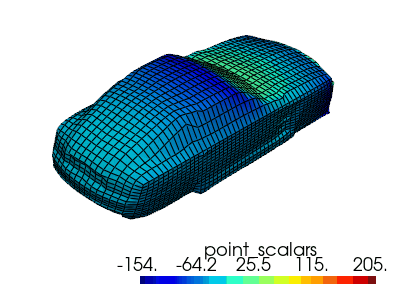
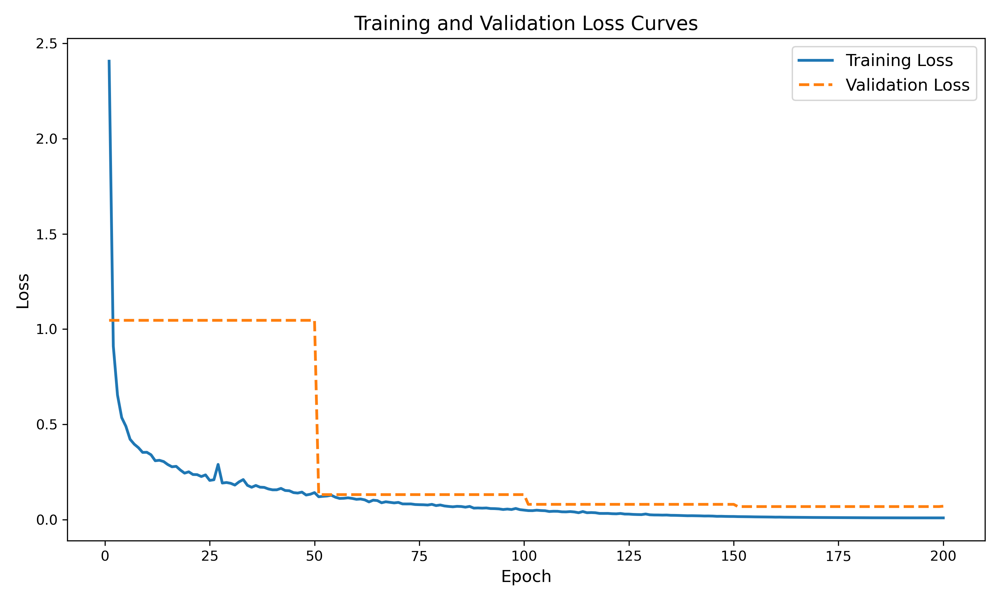
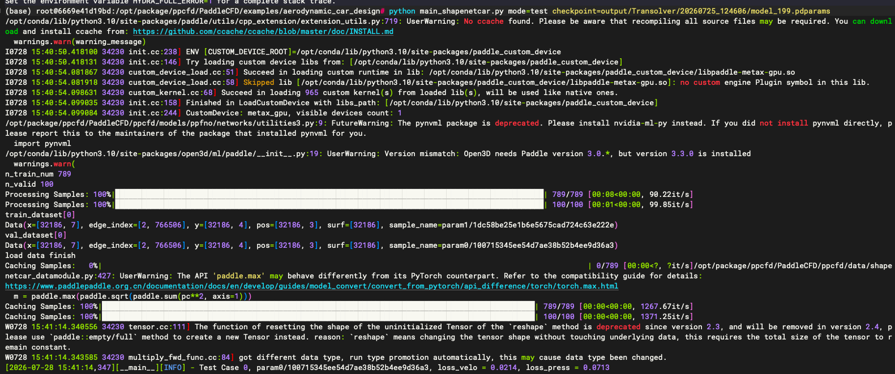
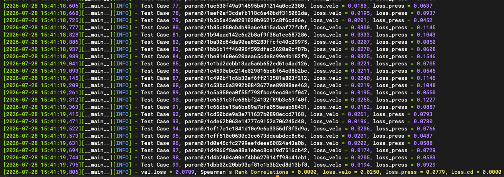

# MetaX GPU Tutorials


```shell
cd /opt/package/ppcfd/PaddleCFD
```

## 1. Aerodynamic Car Design（汽车风阻）

> This model can predict drag of the vehicle in different geometry.



**Configuration:** `MetaX MXC500 64G*1`.

**Speed Up**

| DataSet      | transolver original repo | paddle  |
|--------------|--------------------------|---------|
| ShapeNet-Car | 12 hours                 | 6 hours |
| DrivAerNet++ | TODO                     | TODO    |


**Precision:**

- ShapeNet-Car

| physics | l2 transolver original repo | l2 paddle |
|---------|-----------------------------|-----------|
| surf    | 0.0769                      | 0.0779    |
| volume  | 0.0211                      | 0.0250    |

- DrivAerNet++ (TODO)

**Loss Curve:**



### 1.1 Data Download

I downloaded the data to the data disk and linked it to the corresponding data directory.

```shell
# download data (ShapenetCar)
cd /data
wget https://paddle-org.bj.bcebos.com/paddlecfd/datasets/pptransformer/mlcfd_data.zip
unzip mlcfd_data.zip

# create data directory
cd examples/aerodynamic_car_design/
mkdir -p ./data && cd ./data

# create data link
ln -sf /data/training_data /opt/package/ppcfd/PaddleCFD/examples/aerodynamic_car_design/data/training_data
ln -sf /data/preprocessed_data /opt/package/ppcfd/PaddleCFD/examples/aerodynamic_car_design/data/preprocessed_data
ln -sf /data/graph_raw_data /opt/package/ppcfd/PaddleCFD/examples/aerodynamic_car_design/data/graph_raw_data
ln -sf /data/linear_regression_code /opt/package/ppcfd/PaddleCFD/examples/aerodynamic_car_design/data/linear_regression_code
ln -sf /data/side_by_side_comparisons /opt/package/ppcfd/PaddleCFD/examples/aerodynamic_car_design/data/side_by_side_comparisons
```

### 1.2 Checkpoint Download (Optional)

My checkpoint file is located in the `output/Transolver` directory. It was obtained after about 6 hours of training, or you can use the default checkpoint file provided by the official.

```shell
# default ckpt
mkdir -p ./checkpoint/shapenet_car && cd ./checkpoint/shapenet_car
wget https://paddle-org.bj.bcebos.com/paddlecfd/checkpoints/pptransformer/model_131.pdparams
cd .. && cd ..
```

### 1.3 Train (Useless)

The training instructions are as follows. But I have completed the training process. All you need to do is run the test command.

```shell
# ⚠️ You do not need to train
python main_shapenetcar.py
```

### 1.4 Test

You can use either my checkpoint file or the official default checkpoint file for the test.

```shell
# my ckpt
python main_shapenetcar.py mode=test checkpoint=./output/Transolver/20260725_124606/model_199.pdparams

# OR default ckpt
python main_shapenetcar.py mode=test checkpoint=./checkpoint/shapenet_car/model_131.pdparams
```

If test successfully:





## Aerodynamics（翼型压力）

## Airfoil Wake Flow（翼型尾流）

## Darcy Flow

```shell
```