# MetaX GPU Tutorials


```shell
cd /opt/package/ppcfd/PaddleCFD
```

## 1. Aerodynamic Car Design

> This model can predict drag of the vehicle in different geometry.

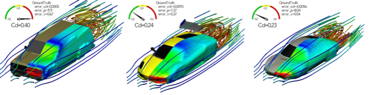

> [1] Wu H, Luo H, Wang H, et al. Transolver: A fast transformer solver for pdes on general geometries[J]. arXiv preprint arXiv:2402.02366, 2024.


**Configuration:** `MetaX MXC500 64G*1`.

**Speed Up**

| DataSet      | transolver original repo | paddle  |
|--------------|--------------------------|---------|
| ShapeNet-Car | 12 hours                 | 6 hours |
| DrivAerNet++ | TODO                     | TODO    |

**Precision:**

- ShapeNet-Car

| physics | l2 transolver original repo | l2 paddle |
|---------|-----------------------------|-----------|
| surf    | 0.0769                      | 0.0779    |
| volume  | 0.0211                      | 0.0250    |

- DrivAerNet++ (TODO)

**Loss Curve:**


### 1.1 Data Download

I downloaded the data to the data disk and linked it to the corresponding data directory.

```shell
# download data (ShapenetCar)
cd /data
wget https://paddle-org.bj.bcebos.com/paddlecfd/datasets/pptransformer/mlcfd_data.zip
unzip mlcfd_data.zip

# create data directory
cd examples/aerodynamic_car_design/
mkdir -p ./data && cd ./data

# create data link
ln -sf /data/training_data /opt/package/ppcfd/PaddleCFD/examples/aerodynamic_car_design/data/training_data
ln -sf /data/preprocessed_data /opt/package/ppcfd/PaddleCFD/examples/aerodynamic_car_design/data/preprocessed_data
ln -sf /data/graph_raw_data /opt/package/ppcfd/PaddleCFD/examples/aerodynamic_car_design/data/graph_raw_data
ln -sf /data/linear_regression_code /opt/package/ppcfd/PaddleCFD/examples/aerodynamic_car_design/data/linear_regression_code
ln -sf /data/side_by_side_comparisons /opt/package/ppcfd/PaddleCFD/examples/aerodynamic_car_design/data/side_by_side_comparisons
```

### 1.2 Checkpoint Download (Optional)

My checkpoint file is located in the `output/Transolver` directory. It was obtained after about 6 hours of training, or you can use the default checkpoint file provided by the official.

```shell
# default ckpt
mkdir -p ./checkpoint/shapenet_car && cd ./checkpoint/shapenet_car
wget https://paddle-org.bj.bcebos.com/paddlecfd/checkpoints/pptransformer/model_131.pdparams
cd .. && cd ..
```

### 1.3 Train (Useless)

The training instructions are as follows. But I have completed the training process. All you need to do is run the test command.

```shell
# ⚠️ You do not need to train
python main_shapenetcar.py
```

### 1.4 Test

You can use either my checkpoint file or the official default checkpoint file for the test.

```shell
# my ckpt
python main_shapenetcar.py mode=test checkpoint=./output/Transolver/20260725_124606/model_199.pdparams

# OR default ckpt
python main_shapenetcar.py mode=test checkpoint=./checkpoint/shapenet_car/model_131.pdparams
```

If test successfully:


## 2. Aerodynamic Airfoil Design


> Given an airfoil’s:
>
> - Geometric parameters (e.g., coordinates, curvature),
> - Flow conditions (e.g., angle of attack, freestream velocity),
>
> PP-DeepOKAN predicts the velocity and pressure distributions over the domain

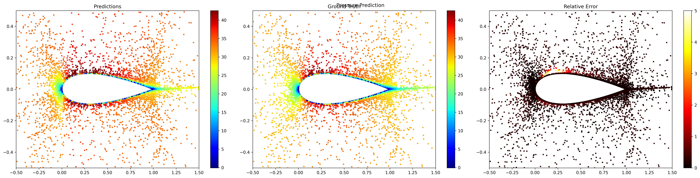

**Configuration:** `MetaX MXC500 16G*1`.

**Runtime:** $\approx$ 27 h

**Pressure Field Prediction Metric on the Test Set:** 2.5064e-02

**Loss Curve:**

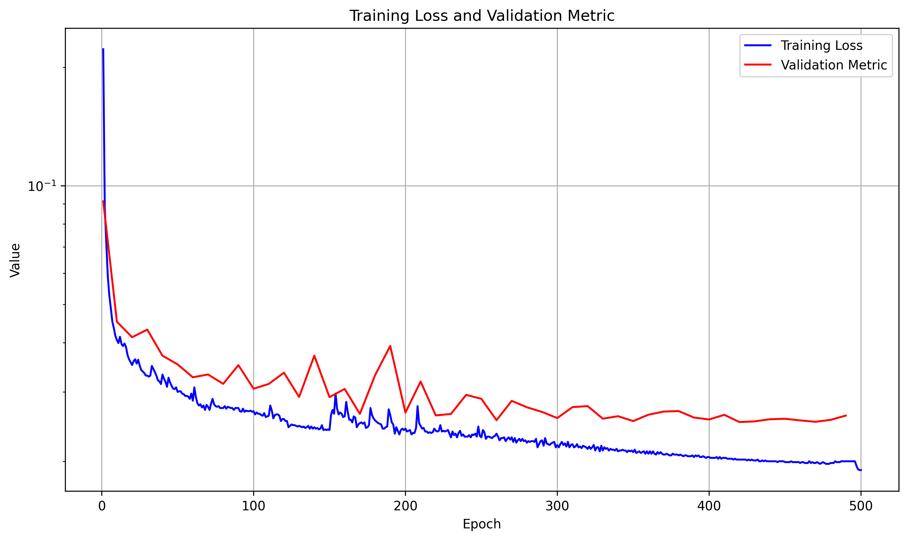

### 2.1 Data Download

I downloaded the data to the data disk and linked it to the corresponding data directory.

```shell
# download data (AirfRANS)
cd /data
wget https://paddle-org.bj.bcebos.com/paddlecfd/datasets/ppkan/AirFoilDataset.zip
unzip AirFoilDataset.zip

# create data link
cd examples/aerodynamics/ppkan
ln -sf /data/Dataset /opt/package/ppcfd/PaddleCFD/examples/aerodynamics/ppkan/Dataset
```

### 2.2 Checkpoint Download (Optional)

My checkpoint file is located in the `outputs-KANONet` directory. It was obtained after about 27 hours of training, or you can use the default checkpoint file provided by the official.

```shell
# default ckpt
mkdir -p ./checkpoint && cd ./checkpoint
wget https://paddle-org.bj.bcebos.com/paddlecfd/checkpoints/ppkan/foil/KANONet_best.pdparams
cd ..
```

### 2.3 Train (Useless)

The training instructions are as follows. But I have completed the training process. All you need to do is run the test command.

```shell
# ⚠️ You do not need to train
python main.py model=KANONet
```

### 2.4 Test

You can use either my checkpoint file or the official default checkpoint file for the test.

```shell
# my ckpt
python main.py mode=test checkpoint=./outputs-KANONet/2026-07-26/22-19-54/KANONet_best.pdparams

# OR default ckpt
python main.py mode=test checkpoint=./checkpoint/KANONet_best.pdparams
```

If test successfully:

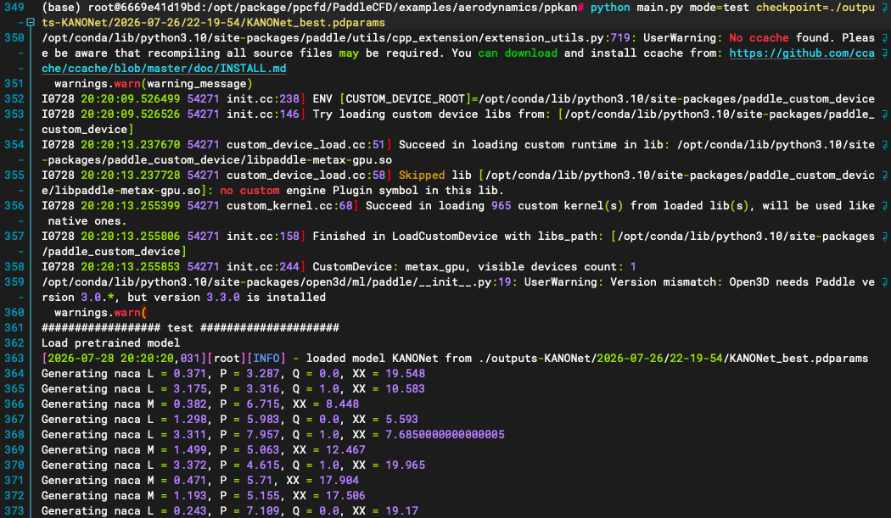

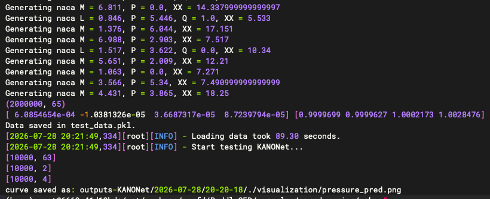

## 3. Airfoil Wake Flow

If test successfully:


## 4. Darcy Flow

### 4.1 MultiONet + SOAP

**WINO vs DeepONet Architecture:**


**Result:**

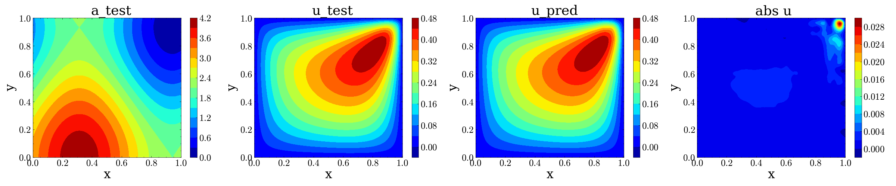

**Configuration:** `MetaX MXC500 16G*1`.

**Runtime:** $\approx$ 2.5 h

**L2 errors of models on the Test Set:** 0.0059

**Loss Curves:**

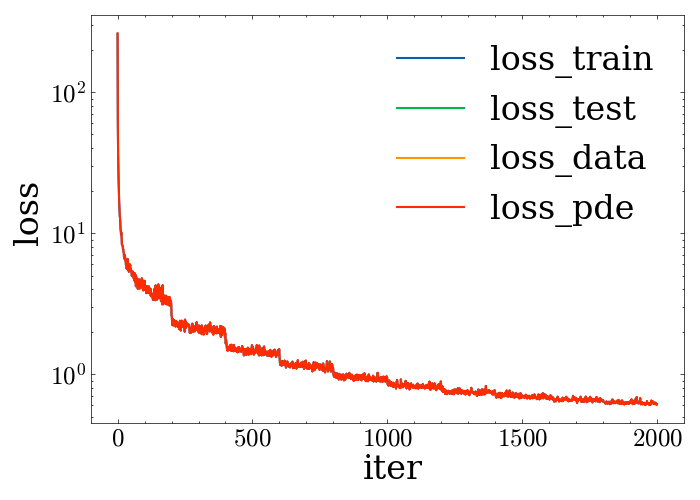

**Error Curves:**

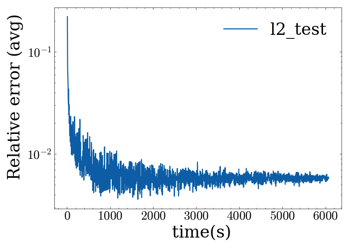

#### 4.1.1 Data Download

I downloaded the data to the data disk and linked it to the corresponding data directory.

```shell
# download data
cd /data
wget -nc -P ./Problems/DarcyFlow_2d/ https://paddle-org.bj.bcebos.com/paddlecfd/datasets/ppdeeponet/darcyflow/smh_train.mat
wget -nc -P ./Problems/DarcyFlow_2d/ https://paddle-org.bj.bcebos.com/paddlecfd/datasets/ppdeeponet/darcyflow/smh_test_in.mat

# create data directory
cd examples/darcyflow/ppdeeponet
mkdir -p ./Problems && cd ./Problems

# create data link
ln -sf /data/DarcyFlow_2d /opt/package/ppcfd/PaddleCFD/examples/darcyflow/ppdeeponet/Problems/DarcyFlow_2d
cd ..
```

#### 4.1.2 Checkpoint Download (Optional)

My checkpoint file is located in the `saved_models/PIMultiONetBatch_fdm_TS` directory. It was obtained after about 2.5 hours of training, or you can use the default checkpoint file provided by the official.

```shell
# default ckpt
mkdir -p ./checkpoint/ && cd ./checkpoint
wget https://paddle-org.bj.bcebos.com/paddlecfd/checkpoints/ppdeeponet/darcyflow/loss_pimultionet.mat
wget https://paddle-org.bj.bcebos.com/paddlecfd/checkpoints/ppdeeponet/darcyflow/model_enc.pdparams
wget https://paddle-org.bj.bcebos.com/paddlecfd/checkpoints/ppdeeponet/darcyflow/model_u.pdparams
cd ..
```

#### 4.1.3 Train (Useless)

The training instructions are as follows. But I have completed the training process. All you need to do is run the test command.

```shell
# ⚠️ You do not need to train
python pimultionet.py
```

#### 4.1.4 Test

You can use either my checkpoint file or the official default checkpoint file by modifying `config_smh.yaml` file for the test.

```yaml
# my ckpt
train:
    save_path: "saved_models/PIMultiONetBatch_fdm_TS/"

# OR default ckpt
train:
    save_path: "checkpoint/"
```

```shell
python pimultionet.py --mode eval
```

If test successfully:

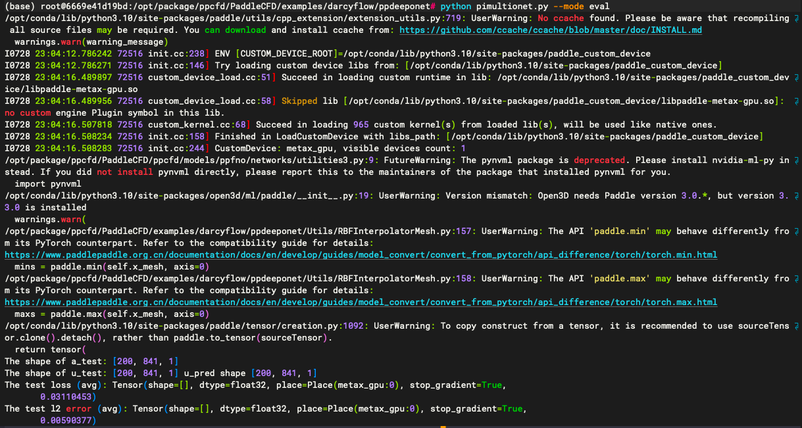

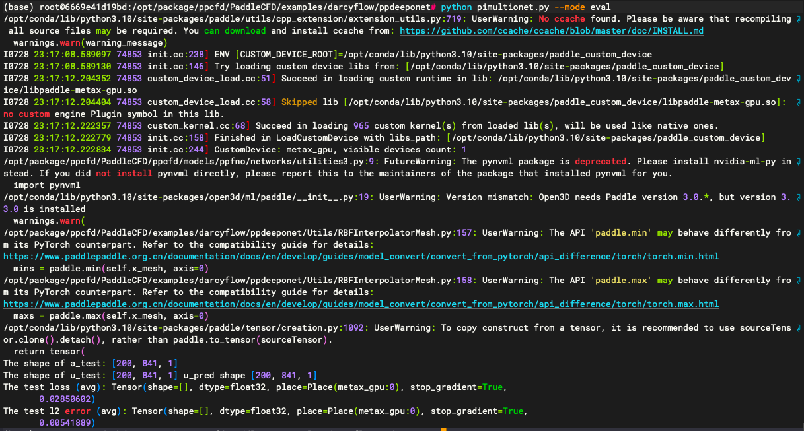

### 4.2 DeepOKAN

**Architecture:**

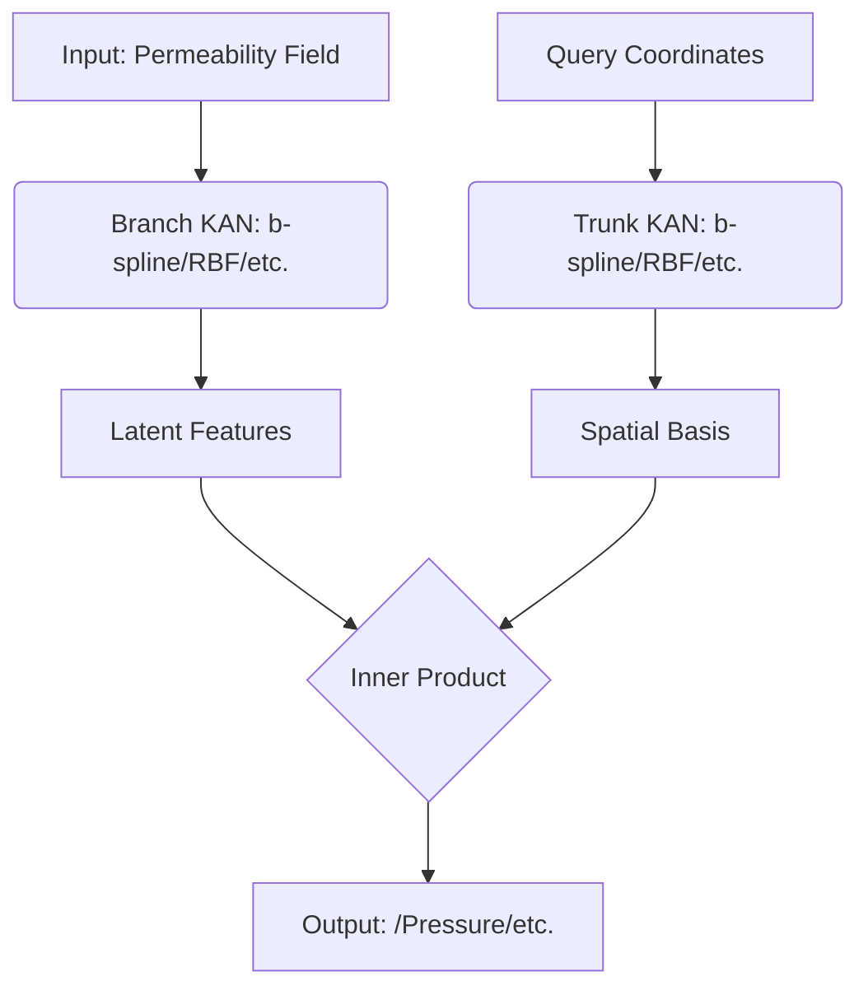

**Result:**

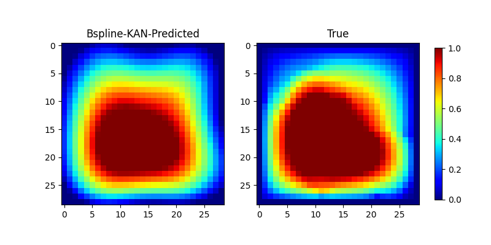

**Configuration:** `MetaX MXC500 16G*1`.

**Runtime:** $\approx$ 2.5 min

**Pressure field prediction relative error on the Test Set MSE:** 0.007108

**Loss Curves:**

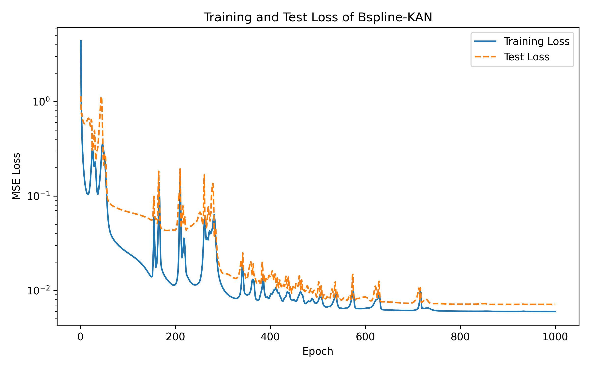

#### 4.2.1 Data Download

I downloaded the data to the data disk and linked it to the corresponding data directory.

```shell
# download data (PDE)
cd /data
wget https://paddle-org.bj.bcebos.com/paddlecfd/datasets/ppkan/piececonst_r421_N1024_smooth1.mat

# create data directory
cd examples/darcyflow/ppkan
mkdir -p ./data && cd ./data

# create data link
ln -sf /data/piececonst_r421_N1024_smooth1.mat /opt/package/ppcfd/PaddleCFD/examples/darcyflow/ppkan/data/piececonst_r421_N1024_smooth1.mat
cd ..
```

#### 4.2.2 Checkpoint Download (Optional)

My checkpoint file is located in the `outputs-KANONet` directory. It was obtained after about 3 minutes of training, or you can use the default checkpoint file provided by the official.

```shell
# default ckpt
mkdir -p ./checkpoint/ && cd ./checkpoint
wget https://paddle-org.bj.bcebos.com/paddlecfd/checkpoints/ppkan/darcy/KANONet_Darcy.pdparams
cd ..
```

#### 4.2.3 Train (Useless)

The training instructions are as follows. But I have completed the training process. All you need to do is run the test command.

```shell
# ⚠️ You do not need to train
python main.py mode=train
```

#### 4.2.4 Test

You can use either my checkpoint file or the official default checkpoint file for the test.

```shell
# my ckpt
python main.py mode=test checkpoint=outputs-KANONet/2026-07-29/00-05-01/KANONet_latest.pdparams

# OR default ckpt
python main.py mode=test checkpoint=checkpoint/KANONet_Darcy.pdparams
```

If test successfully:

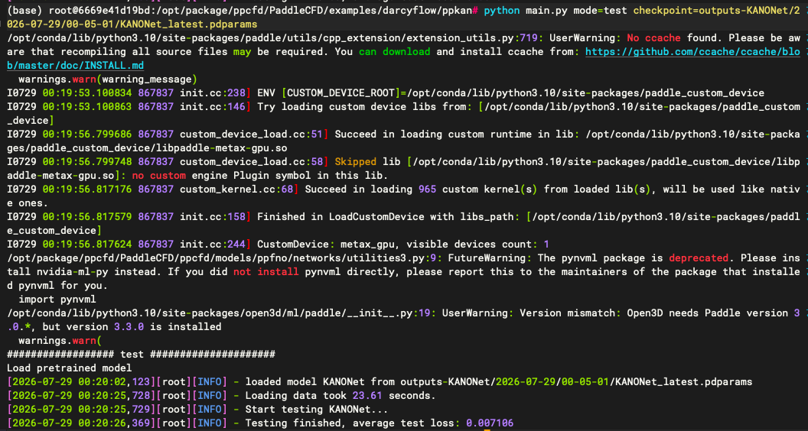

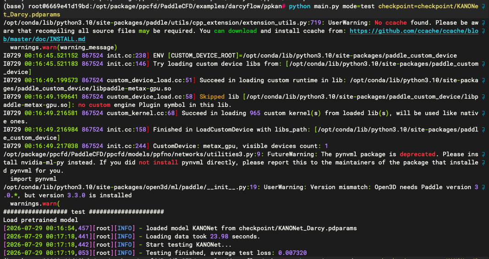
